# Real Time Ray Tracing

## Recap Whitted-Style Ray Tracing

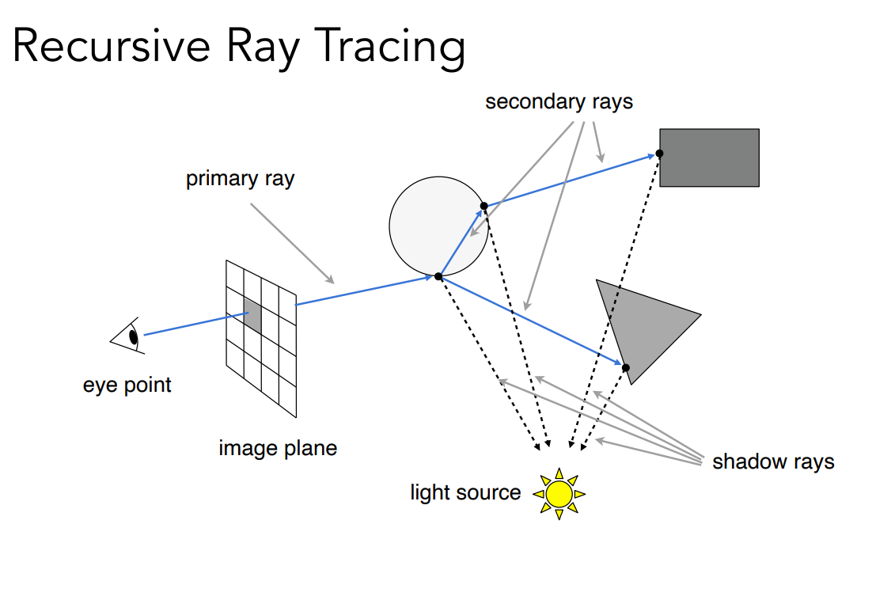

## Accelerate by BVH

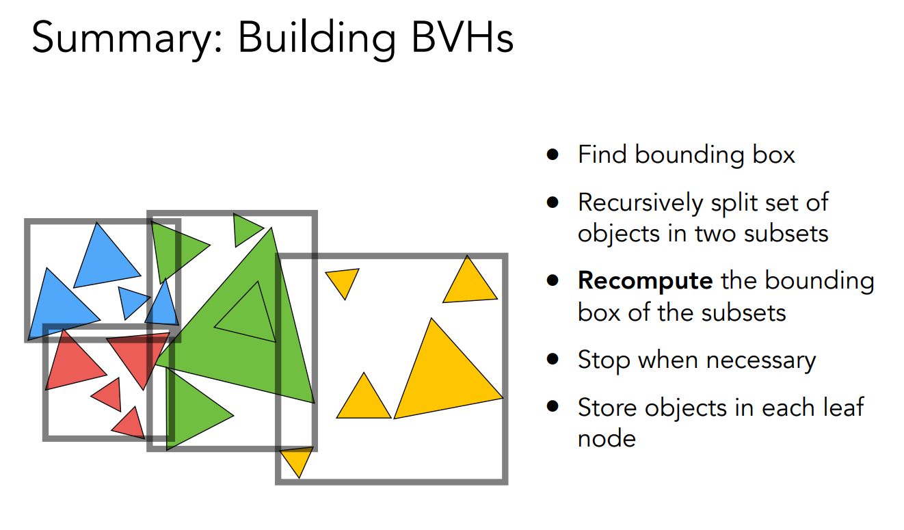

## Whitted-Style Ray Tacing Problems
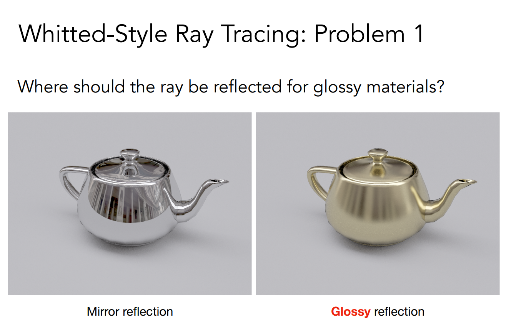


## Radiometry(辐射度量学)

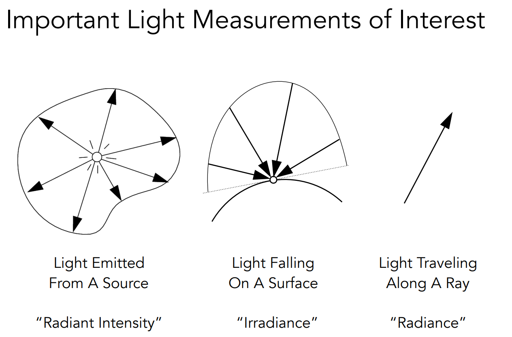


## Path Tracing

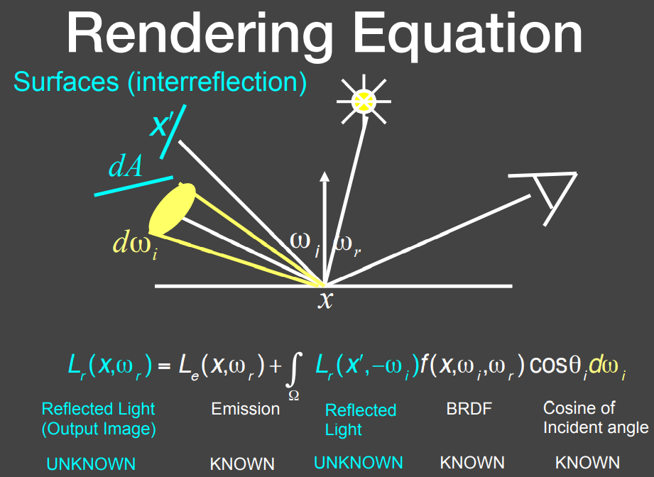
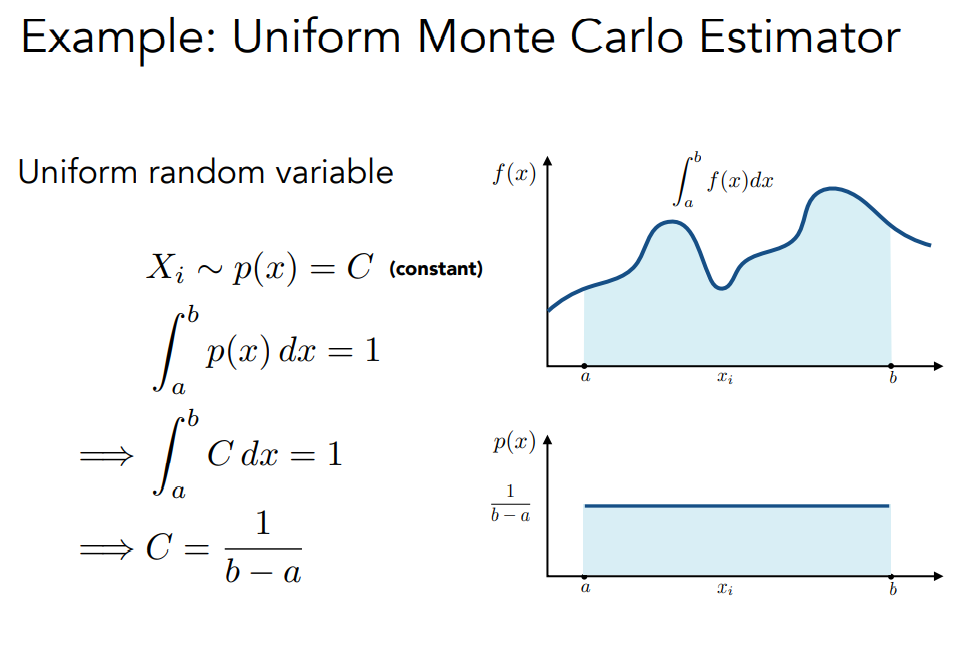
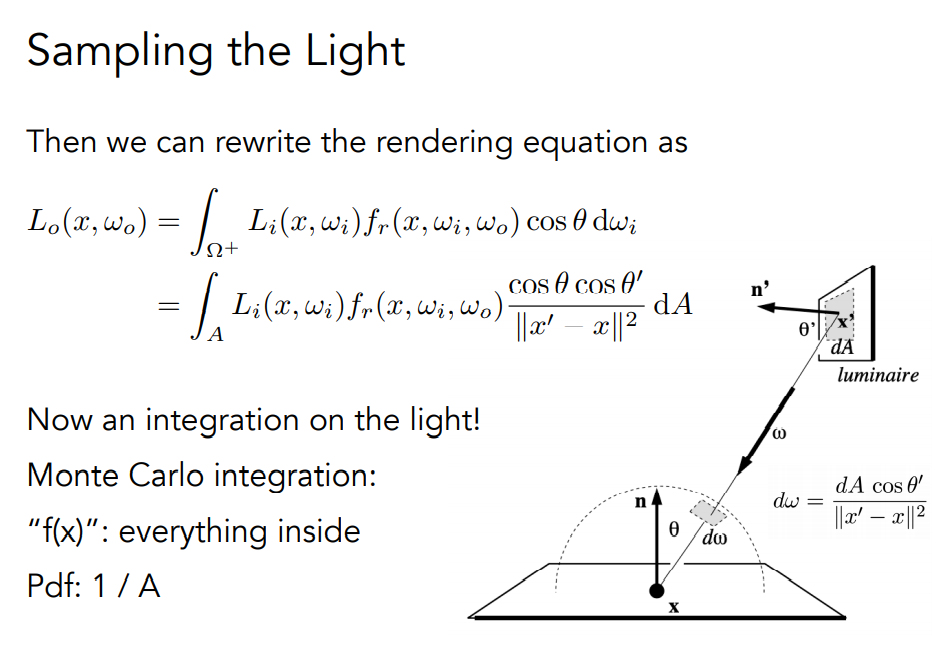
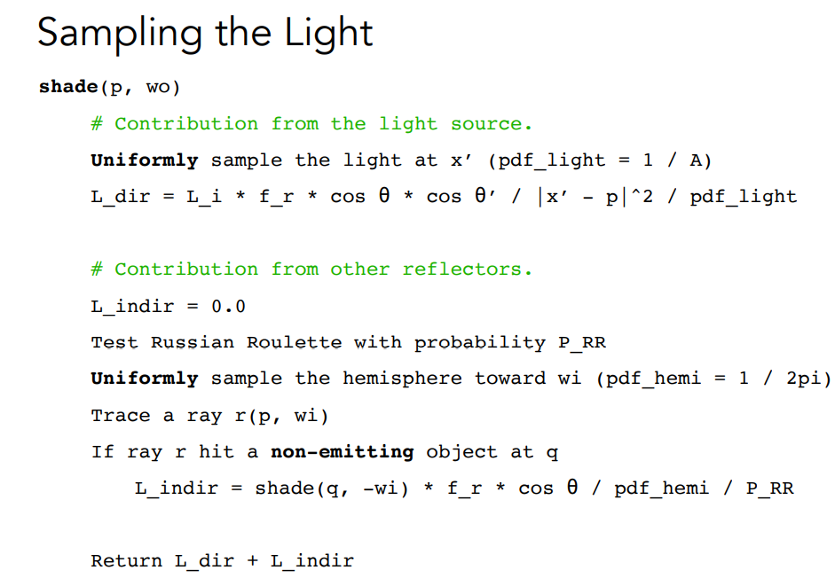

### CPP Implementation
```cpp
// Implementation of Path Tracing
Vector3f Scene::castRay(const Ray& ray, int depth) const
{
    // initialize direct light and indirect light
    Vector3f ldir = { 0, 0, 0 };
    Vector3f lindir = { 0, 0, 0 };
    
    Intersection objectInter = intersect(ray);
    if (!objectInter.happened)
    {
        return {};
    }
    // ray cast to light source, return light emission
    if (objectInter.m->hasEmission())
    {
        return objectInter.m->getEmission();
    }
    // ray cast to object then sample light uniformly
    Intersection lightInter;
    float lightPdf = 0.0f;
    sampleLight(lightInter, lightPdf);//acquire light sample, including light position and sample pdf

    // cal variables below to prepare cal direct light
    Vector3f obj2light = lightInter.coords - objectInter.coords;
    Vector3f obj2lightdir = obj2light.normalized();
    float distancePow2 = obj2light.x * obj2light.x + obj2light.y * obj2light.y + obj2light.z * obj2light.z;

    Ray obj2lightray = Ray{ objectInter.coords, obj2lightdir };
    Intersection t = intersect(obj2lightray);
	if (t.distance - obj2light.norm() > -EPSILON)// No obstruct means this light source is reachable
    {
        //L_dir = L_i * f_r * cos_theta * cos_theta_x / |x - p | ^ 2 / pdf_light
        ldir = lightInter.emit * objectInter.m->eval(ray.direction, obj2lightdir, objectInter.normal) * dotProduct(obj2lightdir, objectInter.normal) * dotProduct(-obj2lightdir, lightInter.normal) / distancePow2 / lightPdf;
    }
    // for indirect light use RR（Russian Roulette Algorithm) to determine whether continue to sample
    if (get_random_float() > RussianRoulette)
    {
        return ldir;
    }
    // get a random direction in semisphere
    Vector3f obj2nextobjdir = objectInter.m->sample(ray.direction, objectInter.normal).normalized();
    // create a ray
    Ray obj2nextobjray = { objectInter.coords, obj2nextobjdir };
    // get object intersection
    Intersection nextObjInter = intersect(obj2nextobjray);
    // if intersect happen and intersection object is not light source
    if (nextObjInter.happened && !nextObjInter.m->hasEmission())
    {
        // cal probability density function
        float pdf = objectInter.m->pdf(ray.direction, obj2nextobjdir, objectInter.normal);
        // shade(q, wi) * f_r * cos_theta / pdf_hemi / P_RR
        lindir = castRay(obj2nextobjray, depth + 1) * objectInter.m->eval(ray.direction, obj2nextobjdir, objectInter.normal) * dotProduct(obj2nextobjdir, objectInter.normal) / pdf / RussianRoulette;
    }
    return ldir + lindir;
}
```

### SPP
```
	// change the spp value to change sample ammount
    int spp = 16;
    std::cout << "SPP: " << spp << "\n";
    for (uint32_t j = 0; j < scene.height; ++j) {
        for (uint32_t i = 0; i < scene.width; ++i) {
            // generate primary ray direction
            float x = (2 * (i + 0.5) / (float)scene.width - 1) *
                      imageAspectRatio * scale;
            float y = (1 - 2 * (j + 0.5) / (float)scene.height) * scale;

            Vector3f dir = normalize(Vector3f(-x, y, 1));
            for (int k = 0; k < spp; k++){
                framebuffer[m] += scene.castRay(Ray(eye_pos, dir), 0) / spp;  
            }
            m++;
        }
    }
```

## Path Tracing CPU Performance
* 16spp 500x500 single core
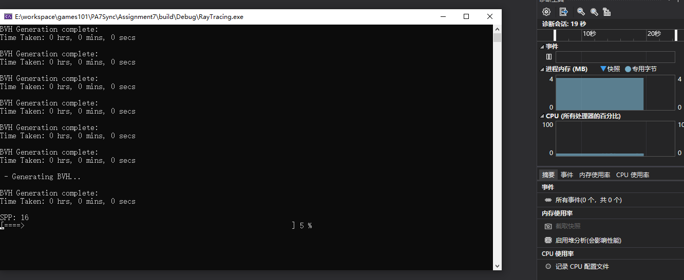
* 16spp 500x500 8 cores 16 threads
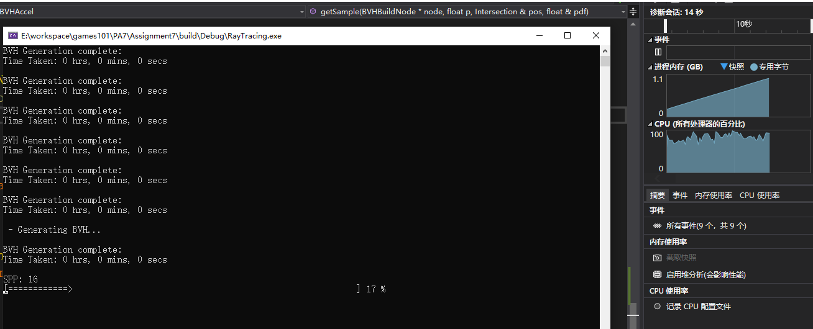
| 16spp 500x500 single core | 16spp 500x500 8 cores 16 threads |
|---|---|
| 117s |  146s |

## Real Time Ray Tracing Model
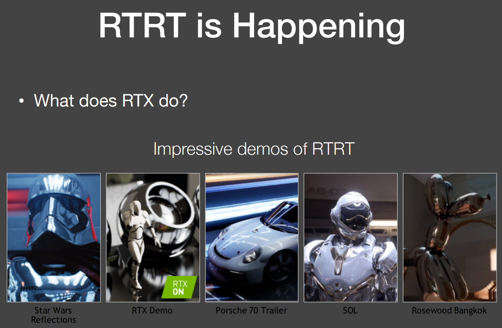
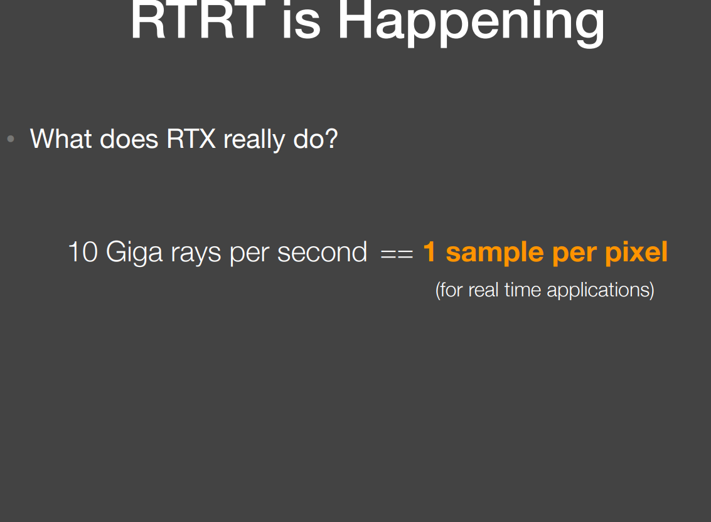
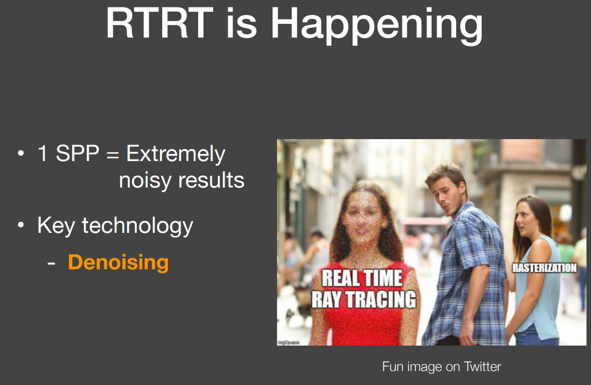

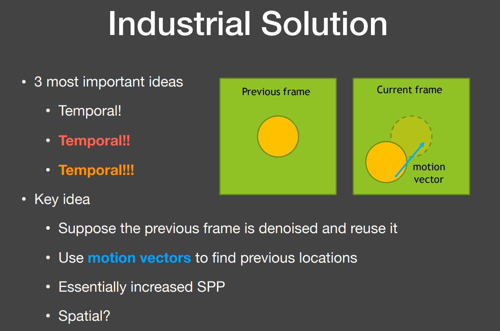
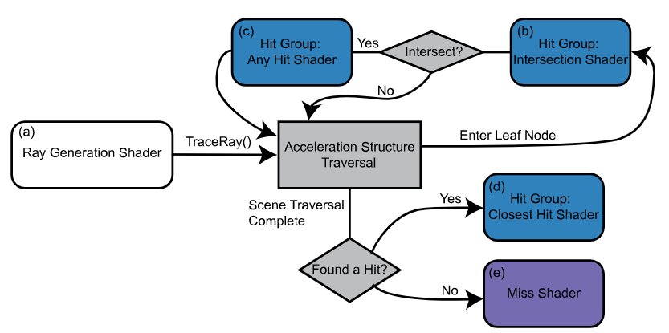

[RTRT Ref.](https://www.willusher.io/graphics/2019/11/20/the-sbt-three-ways)

[RTRT Demo By Optix](cornell_box.mp4)

