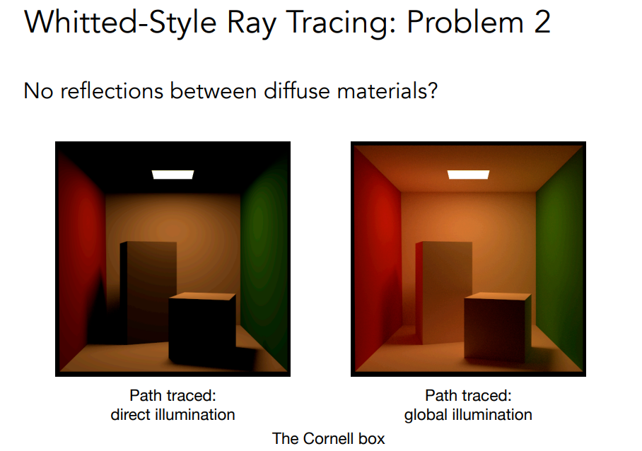
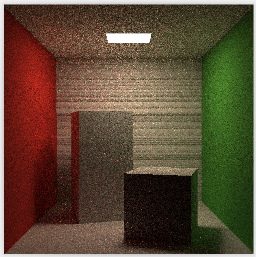

# Real Time Ray Tracing

## Recap Whitted-Style Ray Tracing


## Accelerate by BVH


## Whitted-Style Ray Tacing Problems



## Radiometry(辐射度量学)


## Path Tracing


### CPP Implementation
```cpp
// Implementation of Path Tracing
Vector3f Scene::castRay(const Ray& ray, int depth) const
{
    // initialize direct light and indirect light
    Vector3f ldir = { 0, 0, 0 };
    Vector3f lindir = { 0, 0, 0 };
    
    Intersection objectInter = intersect(ray);
    if (!objectInter.happened)
    {
        return {};
    }
    // ray cast to light source, return light emission
    if (objectInter.m->hasEmission())
    {
        return objectInter.m->getEmission();
    }
    // ray cast to object then sample light uniformly
    Intersection lightInter;
    float lightPdf = 0.0f;
    sampleLight(lightInter, lightPdf);//acquire light sample, including light position and sample pdf

    // cal variables below to prepare cal direct light
    Vector3f obj2light = lightInter.coords - objectInter.coords;
    Vector3f obj2lightdir = obj2light.normalized();
    float distancePow2 = obj2light.x * obj2light.x + obj2light.y * obj2light.y + obj2light.z * obj2light.z;

    Ray obj2lightray = Ray{ objectInter.coords, obj2lightdir };
    Intersection t = intersect(obj2lightray);
	if (t.distance - obj2light.norm() > -EPSILON)// No obstruct means this light source is reachable
    {
        //L_dir = L_i * f_r * cos_theta * cos_theta_x / |x - p | ^ 2 / pdf_light
        ldir = lightInter.emit * objectInter.m->eval(ray.direction, obj2lightdir, objectInter.normal) * dotProduct(obj2lightdir, objectInter.normal) * dotProduct(-obj2lightdir, lightInter.normal) / distancePow2 / lightPdf;
    }
    // for indirect light use RR（Russian Roulette Algorithm) to determine whether continue to sample
    if (get_random_float() > RussianRoulette)
    {
        return ldir;
    }
    // get a random direction in semisphere
    Vector3f obj2nextobjdir = objectInter.m->sample(ray.direction, objectInter.normal).normalized();
    // create a ray
    Ray obj2nextobjray = { objectInter.coords, obj2nextobjdir };
    // get object intersection
    Intersection nextObjInter = intersect(obj2nextobjray);
    // if intersect happen and intersection object is not light source
    if (nextObjInter.happened && !nextObjInter.m->hasEmission())
    {
        // cal probability density function
        float pdf = objectInter.m->pdf(ray.direction, obj2nextobjdir, objectInter.normal);
        // shade(q, wi) * f_r * cos_theta / pdf_hemi / P_RR
        lindir = castRay(obj2nextobjray, depth + 1) * objectInter.m->eval(ray.direction, obj2nextobjdir, objectInter.normal) * dotProduct(obj2nextobjdir, objectInter.normal) / pdf / RussianRoulette;
    }
    return ldir + lindir;
}
```

### SPP
```
	// change the spp value to change sample ammount
    int spp = 16;
    std::cout << "SPP: " << spp << "\n";
    for (uint32_t j = 0; j < scene.height; ++j) {
        for (uint32_t i = 0; i < scene.width; ++i) {
            // generate primary ray direction
            float x = (2 * (i + 0.5) / (float)scene.width - 1) *
                      imageAspectRatio * scale;
            float y = (1 - 2 * (j + 0.5) / (float)scene.height) * scale;

            Vector3f dir = normalize(Vector3f(-x, y, 1));
            for (int k = 0; k < spp; k++){
                framebuffer[m] += scene.castRay(Ray(eye_pos, dir), 0) / spp;  
            }
            m++;
        }
    }
```

## 16spp Result



## Path Tracing CPU Performance
* 16spp 500x500 single core

* 16spp 500x500 8 cores 16 threads

| 16spp 500x500 single core | 16spp 500x500 8 cores 16 threads |
|---|---|
| 117s | 18s |

## Real Time Ray Tracing Model


[RTRT Ref.](https://www.willusher.io/graphics/2019/11/20/the-sbt-three-ways)

## Implementation

```c
// ray gen shader
extern "C" __global__ void __raygen__rg()
{
//...
	int i = params.samples_per_launch;
    do
    {
        // The center of each pixel is at fraction (0.5,0.5)
        const float2 subpixel_jitter = make_float2( rnd( seed ), rnd( seed ) );

        const float2 d = 2.0f * make_float2(
                ( static_cast<float>( idx.x ) + subpixel_jitter.x ) / static_cast<float>( w ),
                ( static_cast<float>( idx.y ) + subpixel_jitter.y ) / static_cast<float>( h )
                ) - 1.0f;
        float3 ray_direction = normalize(d.x*U + d.y*V + W);
        float3 ray_origin    = eye;

        RadiancePRD prd;
        prd.emitted      = make_float3(0.f);
        prd.radiance     = make_float3(0.f);
        prd.attenuation  = make_float3(1.f);
        prd.countEmitted = true;
        prd.done         = false;
        prd.seed         = seed;

        int depth = 0;
        for( ;; )
        {
            // acceleration Structure Traversal
            traceRadiance(
                    params.handle,
                    ray_origin,
                    ray_direction,
                    0.01f,  // tmin       // TODO: smarter offset
                    1e16f,  // tmax
                    &prd );

            result += prd.emitted;
            result += prd.radiance * prd.attenuation;

            if( prd.done  || depth >= 3 ) // TODO RR, variable for depth
                break;

            ray_origin    = prd.origin;
            ray_direction = prd.direction;

            ++depth;
        }
    }
    while( --i );
    //...
}
```
* optixTrace is too complex to understand
```c
static __forceinline__ __device__ void traceRadiance(
        OptixTraversableHandle handle,
        float3                 ray_origin,
        float3                 ray_direction,
        float                  tmin,
        float                  tmax,
        RadiancePRD*           prd
        )
{
    // TODO: deduce stride from num ray-types passed in params

    unsigned int u0, u1;
    packPointer( prd, u0, u1 );
    // acceleration Structure Traversal
    optixTrace(
            handle,
            ray_origin,
            ray_direction,
            tmin,
            tmax,
            0.0f,                // rayTime
            OptixVisibilityMask( 1 ),
            OPTIX_RAY_FLAG_NONE,
            RAY_TYPE_RADIANCE,        // SBT offset
            RAY_TYPE_COUNT,           // SBT stride
            RAY_TYPE_RADIANCE,        // missSBTIndex
            u0, u1 );
}

// miss shader
extern "C" __global__ void __miss__radiance()
{
    MissData* rt_data  = reinterpret_cast<MissData*>( optixGetSbtDataPointer() );
    RadiancePRD* prd = getPRD();

    prd->radiance = make_float3( rt_data->bg_color );
    prd->done      = true;
}

// closesthit occlusion
extern "C" __global__ void __closesthit__occlusion()
{
    setPayloadOcclusion( true );
}

// closest hit shader
extern "C" __global__ void __closesthit__radiance()
{
	// get closest hit group
    HitGroupData* rt_data = (HitGroupData*)optixGetSbtDataPointer();

    const int    prim_idx        = optixGetPrimitiveIndex();
    const float3 ray_dir         = optixGetWorldRayDirection();
    // vertex index offset
    const int    vert_idx_offset = prim_idx*3;
	
    //get triangle and normal
    const float3 v0   = make_float3( rt_data->vertices[ vert_idx_offset+0 ] );
    const float3 v1   = make_float3( rt_data->vertices[ vert_idx_offset+1 ] );
    const float3 v2   = make_float3( rt_data->vertices[ vert_idx_offset+2 ] );
    const float3 N_0  = normalize( cross( v1-v0, v2-v0 ) );
	
    //judge intersect is face forward 
    // faceforward(const float3& n, const float3& i, const float3& nref)
    // Returns N if dot(i, nref) > 0; else -N;
    const float3 N    = faceforward( N_0, -ray_dir, N_0 );
    // get intersect point
    const float3 P    = optixGetWorldRayOrigin() + optixGetRayTmax()*ray_dir;

    RadiancePRD* prd = getPRD();

    if( prd->countEmitted )
        // get emission color
        prd->emitted = rt_data->emission_color;
    else
        prd->emitted = make_float3( 0.0f );


    unsigned int seed = prd->seed;

    {
        const float z1 = rnd(seed);
        const float z2 = rnd(seed);

        float3 w_in;
        cosine_sample_hemisphere( z1, z2, w_in );
        Onb onb( N );
        onb.inverse_transform( w_in );
        prd->direction = w_in;
        prd->origin    = P;

        prd->attenuation *= rt_data->diffuse_color;
        prd->countEmitted = false;
    }

    const float z1 = rnd(seed);
    const float z2 = rnd(seed);
    prd->seed = seed;

    ParallelogramLight light = params.light;
    const float3 light_pos = light.corner + light.v1 * z1 + light.v2 * z2;

    // Calculate properties of light sample (for area based pdf)
    const float  Ldist = length(light_pos - P );
    const float3 L     = normalize(light_pos - P );
    const float  nDl   = dot( N, L );
    const float  LnDl  = -dot( light.normal, L );

    float weight = 0.0f;
    if( nDl > 0.0f && LnDl > 0.0f )
    {
        const bool occluded = traceOcclusion(
            params.handle,
            P,
            L,
            0.01f,         // tmin
            Ldist - 0.01f  // tmax
            );

        if( !occluded )
        {
            const float A = length(cross(light.v1, light.v2));
            weight = nDl * LnDl * A / (M_PIf * Ldist * Ldist);
        }
    }

    prd->radiance += light.emission * weight;
}
```


## RTRT Result


[RTRT Demo By Optix](cornell_box.mp4)

